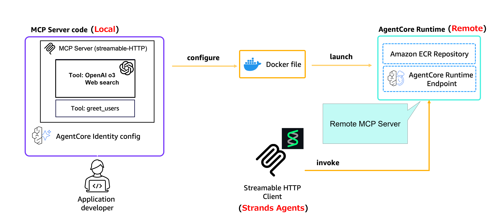

# AWS Bedrock AgentCore Runtime Remote MCP

OpenAI o3 と Web Search を組み合わせた MCP（Model Context Protocol）サーバーを AWS Bedrock AgentCore Runtime にデプロイし，Strands Agents や Claude Code から利用可能にするプロジェクトです．

> [!NOTE]
> 解説記事を公開しております．是非ご覧ください．
> [Bedrock AgentCore Runtime で Remote MCP サーバー (OpenAI o3 Web search) をデプロイし，Strands Agents から利用する](https://qiita.com/ren8k/items/1ef730d343c870b71e50)

## アーキテクチャ

本プロジェクトでは，以下のアーキテクチャで構成されています．

1. MCP Server: OpenAI o3 + Web Search 機能を提供する MCP サーバー
2. AgentCore Runtime: MCP サーバーをホストする AWS マネージドサービス
3. MCP Clients: Strands Agents，Claude Code，またはカスタム実装からの接続



## 実行環境

- OS: Ubuntu Server 24.04 LTS
- AMI: 01e1d8271212cd19a (Deep Learning OSS Nvidia Driver AMI GPU PyTorch 2.7)
- Instance Type: m8g.xlarge (ARM)
- Docker version: 28.3.2, build 578ccf6
- uv version: 0.8.3
- default region: us-west-2

## プロジェクト構成

このプロジェクトは以下の 3 つの主要コンポーネントで構成されています．

### 1. MCP Server (`mcp_server/`)

AWS Bedrock Agent Runtime 上でホストされる MCP サーバーです．

- 主な機能: OpenAI o3 モデルを使用した Web 検索機能
- エンドポイント: FastMCP フレームワークを使用
- デプロイ: Docker コンテナとしてデプロイ可能

主な依存関係:

- `mcp==1.12.2`
- `openai==1.98.0`
- `bedrock-agentcore-starter-toolkit>=0.1.2`

### 2. MCP Client (`mcp_client/`)

リモート MCP サーバーと通信するクライアントアプリケーションです．

- 主な機能: MCP サーバーとの通信，Streamlit ベースのユーザーインターフェース
- 接続方式: HTTP streaming 接続
- UI: Streamlit アプリケーション

主な依存関係:

- `mcp==1.12.2`
- `boto3>=1.39.9`
- `strands-agents-tools>=0.2.1`

### 3. Setup (`setup/`)

AWS 環境のセットアップとリソース作成を行うツール群です．

- 機能: Cognito 設定，IAM ロール作成，アクセスキー管理
- 対応サービス: AWS Cognito，IAM

主な依存関係:

- `boto3>=1.39.9`
- `python-dotenv>=1.1.1`

## セットアップ手順

### 前提条件

- 開発環境: ARM アーキテクチャ（AgentCore Runtime の要件）
- AMI 推奨: AWS Deep Learning AMI (Docker, AWS CLI プリインストール)
- Python: 3.12 以上，[uv](https://docs.astral.sh/uv/) インストール済み
- OpenAI API Key: o3 利用のため必要

### Step 1: 環境変数の設定

`.env.sample` をコピーして `.env` を作成し，以下の変数を設定：

```bash
cp .env.sample .env
# 以下を .env に設定
OPENAI_API_KEY=your_openai_api_key
COGNITO_USERNAME=testuser
COGNITO_PASSWORD=YourPassword123!
AGENT_NAME=your_agent_name
```

### Step 2: MCP サーバーの開発とテスト

```bash
cd mcp_server
uv sync
# ローカルでのテスト実行
uv run src/mcp_server.py

# 別ターミナルでクライアントテスト
cd ../mcp_client
uv sync
uv run src/mcp_client_local.py
```

### Step 3: AWS リソースのセットアップ

```bash
cd ../setup
uv sync

# Cognito User Pool と認証情報の作成
uv run src/setup_cognito.py
# 出力された Client ID, Discovery URL, Bearer Token を .env に追加

# IAM ロールの作成
uv run src/create_role.py
# 出力された Role ARN を .env に追加
```

### Step 4: AgentCore Runtime へのデプロイ

```bash
cd ../mcp_server
# MCP サーバーを AgentCore Runtime にデプロイ
uv run scripts/deploy_mcp_server.py
# 出力された Agent ARN を .env に追加
```

### Step 5: Remote MCP サーバーの動作確認

```bash
cd ../mcp_client
# Remote MCP サーバーとの接続テスト
uv run src/mcp_client_remote.py
# Strands Agents からの利用
uv run src/agent.py
```

## ライセンス

このプロジェクトのライセンス情報については，`LICENSE`ファイルを参照してください．
